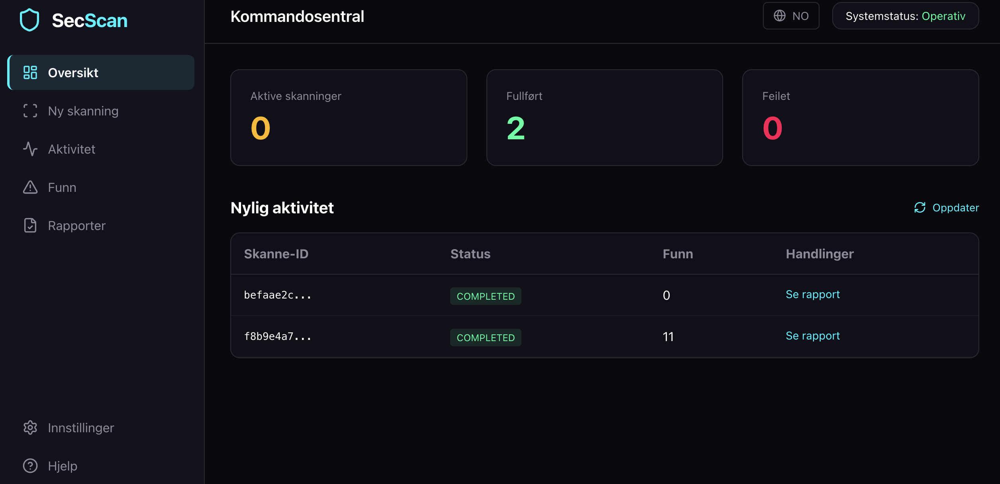
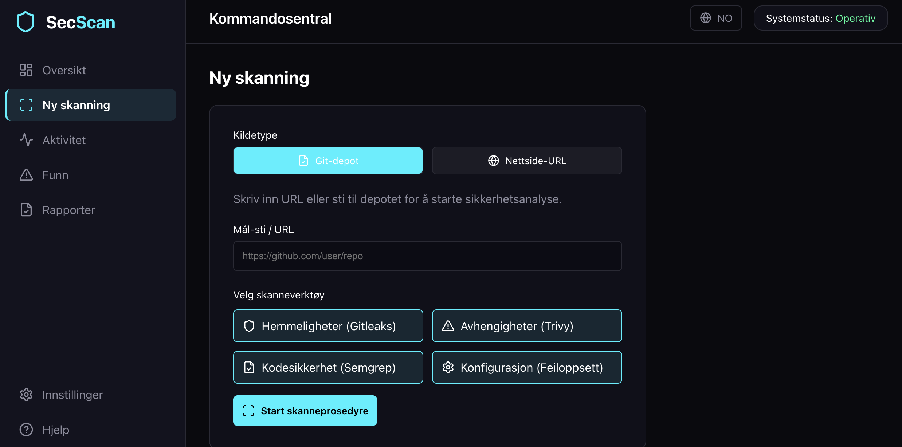
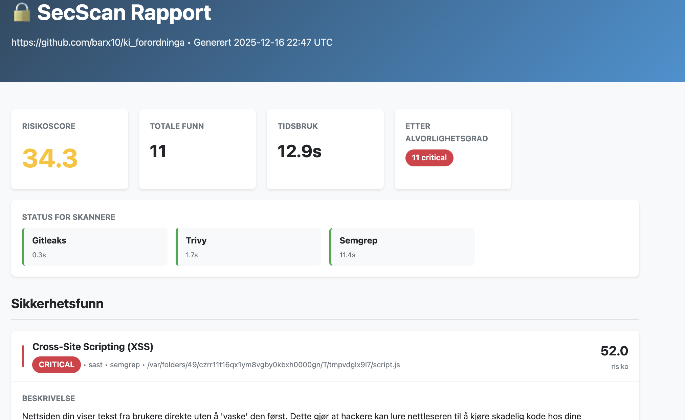
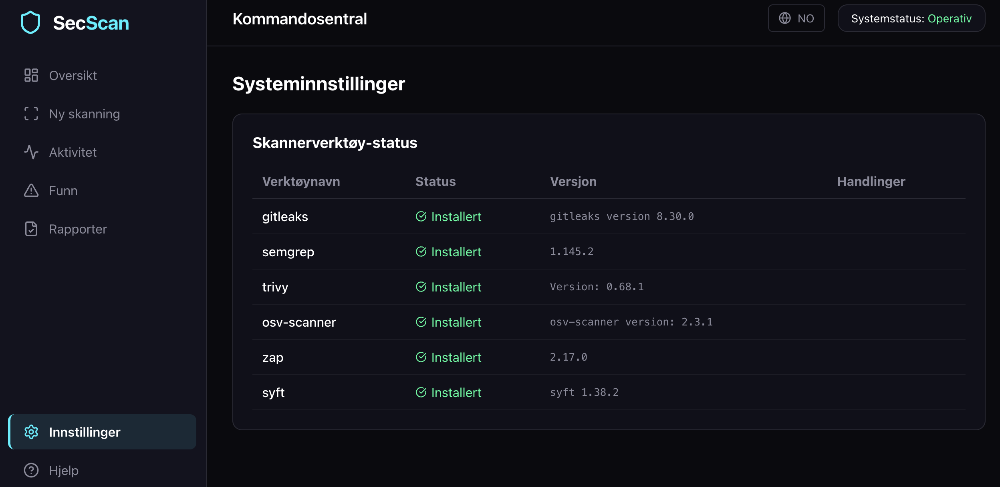
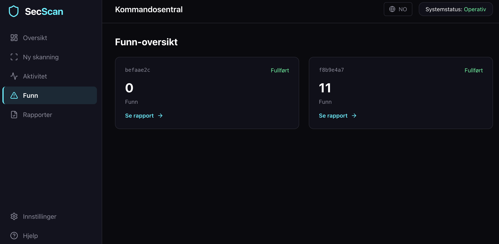
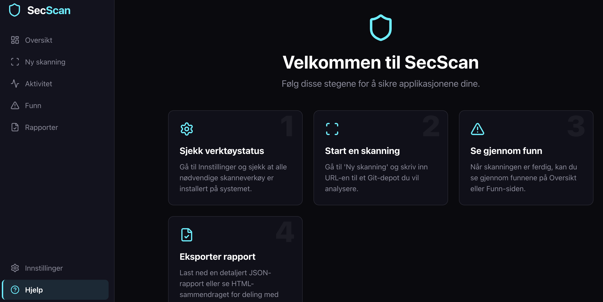

# 🛡️ SecScan

**[🇬🇧 English](#english) | [🇳🇴 Norsk](#norsk)**

---

### 📸 Screenshots / Skjermbilder

<details>
<summary><strong>Click to view screenshots / Klikk for å se skjermbilder</strong></summary>

| Dashboard | New Scan |
|:---------:|:--------:|
|  |  |

| Scan Report | Settings |
|:-----------:|:--------:|
|  |  |

| Findings | Help |
|:--------:|:----:|
|  |  |

</details>

---

<a name="english"></a>
## 🇬🇧 English

Security vulnerability scanner for applications and AI-constructed websites.

### Features

- **Secrets Scanning**: Detect hardcoded secrets, API keys, and credentials using gitleaks
- **Dependency Scanning**: Find vulnerable dependencies using osv-scanner and trivy
- **SAST**: Static analysis with semgrep for code vulnerabilities
- **Config Scanning**: Detect misconfigurations in Dockerfiles, Kubernetes manifests, Terraform, etc.
- **Web Scanning**: Fast web application security scanning with Nuclei
- **SBOM Generation**: Generate Software Bill of Materials with syft

### Quick Start

#### Installation

```bash
pip install -e .
```

#### Check Available Tools

```bash
secscan check-tools
```

#### Scan a Repository

```bash
# Full scan with table output
secscan scan ./my-project

# Generate HTML report
secscan scan ./my-project -f html -o report.html

# Generate JSON report
secscan scan ./my-project -f json -o report.json

# Scan specific types only
secscan scan ./my-project -t secrets -t deps

# Fail on high severity (for CI)
secscan scan ./my-project --fail-on high
```

#### Scan a Zip File

```bash
secscan scan ./source.zip -o report.html -f html
```

#### Scan a URL

```bash
secscan scan https://example.com -t web
```

### Web Interface

Start the web interface:

**macOS/Linux:**
```bash
# Start the API backend
uvicorn apps.api.main:app --port 8080 &

# Start the frontend dev server
cd apps/web && npm run dev
```

**Windows (run in two separate terminals):**
```powershell
# Terminal 1: Start the API backend
uvicorn apps.api.main:app --port 8080

# Terminal 2: Start the frontend dev server
cd apps/web
npm run dev
```

Open http://localhost:5173 in your browser.

### API Endpoints

- `POST /scans` - Create a new scan
- `GET /scans/{scan_id}` - Get scan status
- `GET /scans/{scan_id}/report` - Get scan report (JSON)
- `GET /scans/{scan_id}/report.html` - Get scan report (HTML)
- `GET /tools` - List available scanner tools
- `POST /scans/upload` - Upload and scan a zip file

### Required Tools

Install the scanner tools:

**macOS/Linux (Homebrew):**

| Tool | Installation |
|------|-------------|
| gitleaks | `brew install gitleaks` |
| semgrep | `pip install semgrep` |
| trivy | `brew install trivy` |
| osv-scanner | `brew install osv-scanner` |
| syft | `brew install syft` |
| Nuclei | `go install -v github.com/projectdiscovery/nuclei/v3/cmd/nuclei@latest` |

**Windows (Scoop):**

```powershell
# Install Scoop first: https://scoop.sh
scoop install gitleaks trivy osv-scanner syft
pip install semgrep
# Nuclei: go install -v github.com/projectdiscovery/nuclei/v3/cmd/nuclei@latest
```

### Exit Codes

| Code | Meaning |
|------|---------|
| 0 | No issues meeting threshold |
| 1 | Issues found meeting failure threshold |
| 2 | Scan failed |

---

<a name="norsk"></a>
## 🇳🇴 Norsk

Sikkerhetsscanner for applikasjoner og AI-genererte nettsider.

### Funksjoner

- **Hemmelighetsscanning**: Oppdager hardkodede passord, API-nøkler og legitimasjon med gitleaks
- **Avhengighetsscanning**: Finner sårbare biblioteker med osv-scanner og trivy
- **SAST (Kodeanalyse)**: Statisk analyse med semgrep for kodesårbarheter
- **Konfigurasjonsscanning**: Oppdager feilkonfigurasjon i Dockerfiler, Kubernetes, Terraform, osv.
- **Nettsidesanning**: Rask skanning av webapplikasjoner med Nuclei
- **SBOM-generering**: Genererer Software Bill of Materials med syft

### Kom i gang

#### Installasjon

```bash
pip install -e .
```

#### Sjekk tilgjengelige verktøy

```bash
secscan check-tools
```

#### Skann et repository

```bash
# Full skanning med tabellutdata
secscan scan ./mitt-prosjekt

# Generer HTML-rapport
secscan scan ./mitt-prosjekt -f html -o rapport.html

# Generer JSON-rapport  
secscan scan ./mitt-prosjekt -f json -o rapport.json

# Skann kun bestemte typer
secscan scan ./mitt-prosjekt -t secrets -t deps

# Feil ved høy alvorlighetsgrad (for CI)
secscan scan ./mitt-prosjekt --fail-on high
```

#### Skann en zip-fil

```bash
secscan scan ./kildekode.zip -o rapport.html -f html
```

#### Skann en nettside

```bash
secscan scan https://eksempel.no -t web
```

### Webgrensesnitt

Start webgrensesnittet:

**macOS/Linux:**
```bash
# Start API-backend
uvicorn apps.api.main:app --port 8080 &

# Start frontend-utviklingsserver
cd apps/web && npm run dev
```

**Windows (kjør i to separate terminaler):**
```powershell
# Terminal 1: Start API-backend
uvicorn apps.api.main:app --port 8080

# Terminal 2: Start frontend-utviklingsserver
cd apps/web
npm run dev
```

Åpne http://localhost:5173 i nettleseren.

### API-endepunkter

- `POST /scans` - Opprett ny skanning
- `GET /scans/{scan_id}` - Hent skannestatus
- `GET /scans/{scan_id}/report` - Hent skannerapport (JSON)
- `GET /scans/{scan_id}/report.html?lang=no` - Hent skannerapport på norsk (HTML)
- `GET /tools` - List tilgjengelige skannerverktøy
- `POST /scans/upload` - Last opp og skann en zip-fil

### Nødvendige verktøy

Installer skannerverktøyene:

**macOS/Linux (Homebrew):**

| Verktøy | Installasjon |
|---------|--------------|
| gitleaks | `brew install gitleaks` |
| semgrep | `pip install semgrep` |
| trivy | `brew install trivy` |
| osv-scanner | `brew install osv-scanner` |
| syft | `brew install syft` |
| Nuclei | `go install -v github.com/projectdiscovery/nuclei/v3/cmd/nuclei@latest` |

**Windows (Scoop):**

```powershell
# Installer Scoop først: https://scoop.sh
scoop install gitleaks trivy osv-scanner syft
pip install semgrep
# Nuclei: go install -v github.com/projectdiscovery/nuclei/v3/cmd/nuclei@latest
```

### Avslutningskoder

| Kode | Betydning |
|------|-----------|
| 0 | Ingen problemer over terskel |
| 1 | Problemer funnet over feilterskel |
| 2 | Skanningen feilet |

---

## 🔒 Security Notice / Sikkerhetsvarsel

**🇬🇧 English:**

**⚠️ WARNING: This tool is designed for LOCAL USE ONLY**

SecScan analyzes source code and discovers vulnerabilities, which makes it a sensitive security tool. **Do not deploy this as a public web service** without proper security measures.

**Why?**
- Users upload source code containing secrets, credentials, and proprietary information
- Vulnerability reports contain sensitive security information
- The tool becomes an attractive target for attackers
- GDPR, NDA, and compliance requirements

**Recommended Usage:**
- ✅ **Local development** - Run on your own machine
- ✅ **CI/CD pipelines** - GitHub Actions, GitLab CI (isolated environments)
- ✅ **On-premise deployment** - Internal company servers with access control
- ⚠️ **Self-hosted** - Only with strict authentication, encryption, and network isolation
- ❌ **Public cloud hosting** - Not recommended without comprehensive security hardening

The web interface is provided for convenience in **secure, trusted environments only**.

---

**🇳🇴 Norsk:**

**⚠️ ADVARSEL: Dette verktøyet er designet for LOKAL BRUK**

SecScan analyserer kildekode og oppdager sårbarheter, noe som gjør det til et sensitivt sikkerhetsverktøy. **Ikke deploy dette som en offentlig nettjeneste** uten grundige sikkerhetstiltak.

**Hvorfor?**
- Brukere laster opp kildekode som inneholder hemmeligheter, passord og proprietær informasjon
- Sårbarhetsrapporter inneholder sensitiv sikkerhetsinformasjon
- Verktøyet blir et attraktivt mål for angripere
- GDPR, NDA og compliance-krav

**Anbefalt bruk:**
- ✅ **Lokal utvikling** - Kjør på din egen maskin
- ✅ **CI/CD pipelines** - GitHub Actions, GitLab CI (isolerte miljøer)
- ✅ **On-premise deployment** - Interne bedriftsservere med tilgangskontroll
- ⚠️ **Self-hosted** - Kun med streng autentisering, kryptering og nettverksisolering
- ❌ **Offentlig cloud-hosting** - Ikke anbefalt uten omfattende sikkerhetstiltak

Webgrensesnittet er laget for bekvemmelighet i **sikre, betrodde miljøer kun**.

---

## Architecture / Arkitektur

```
secscan/
├── apps/
│   ├── api/          # FastAPI web API
│   ├── cli/          # Typer CLI application
│   ├── web/          # React frontend (Vite)
│   └── worker/       # Background scan worker
├── packages/
│   ├── core/         # Core models, pipeline, scoring
│   ├── adapters/     # Scanner tool adapters
│   ├── reporter/     # JSON/HTML report generators
│   └── storage/      # SQLite/PostgreSQL storage
└── configs/          # Default configuration
```

## License / Lisens

MIT
